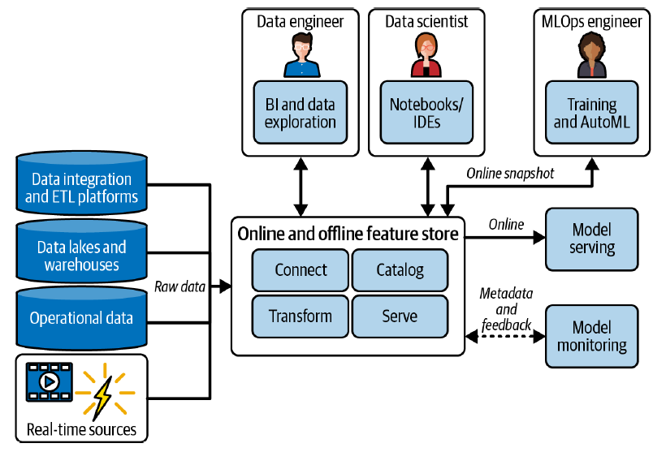
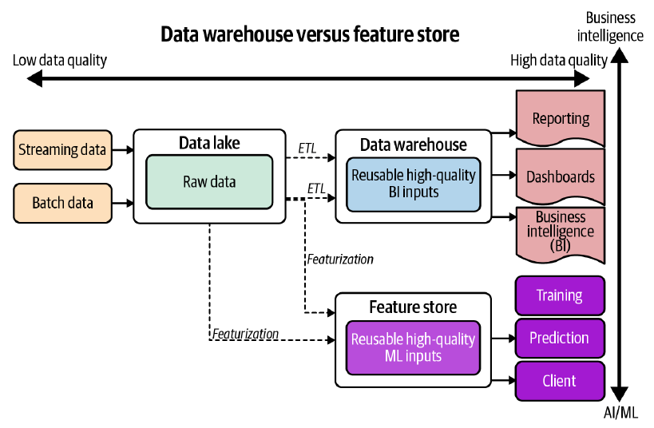

# O que é Feature Store?

As primeiras implementações de Feature Stores vieram de empresas como Uber, Twitter e Spotify, onde modelos de ML e IA são centrais para o negócio. 

Em uma postagem de 2017 no blog de engenharia da Uber ([https://www.uber.com/en-BR/blog/michelangelo-machine-learning-platform/](https://www.uber.com/en-BR/blog/michelangelo-machine-learning-platform/)), é possível checar alguns relatos sobre o uso de Feature Store na plataforma de ML deles, o Michelangelo.

>  *... we added a layer of data management, a feature store that allows teams to share, discover, and use a highly curated set of features for their machine learning problems.  We found that many modeling problems at Uber use identical or similar features, and there is substantial value in enabling teams to share features between their own projects and for teams in different organizations to share features with each other.*

E ainda...

> *At the moment, we have approximately 10,000 features in Feature Store that are used to accelerate machine learning projects, and teams across the company are adding new ones all the time. Features in the Feature Store are automatically calculated and updated daily.*

Feature Stores podem operar como uma fábrica e/ou um repositório central de features para ML, onde dependendo da solução utilizada, é possível realizar gerenciando a coleta de dados brutos de várias fontes, realização de transformações, armazenamento, catalogação, versionamento, segurança, fornecimento e monitoramento de features, entre outras funcionalidades. 

O Feature Store é um recurso no sistema de ML que possibilita a automatização de processos reduzindo os esforços de engenharia através da criação de um catálogo compartilhado de features prontas para utilização pelos membros do time, permitindo a colaboração e compartilhamento de features entre equipes, com objetivo de acelerar a entrega de sistemas de ML. 

## Provedores de Feature Store

Hoje, existem múltiplas implementações comerciais e de código aberto. Idealmente soluções de Feature Stores avançadas devem oferecer todas as funcionalidade citadas aqui anteriormente. Comparar cuidadosamente as capacidades de diferentes provedores de Feature Stores é essencial, pois algumas soluções podem ter limitações, não fornecendo algumas funcionalidades que podem ser indispensáveis para o contexto do sistema de ML que está sendo desenvolvido. A seguir segue um comparativo de soluções atualmente disponíveis de Feature Store.

  <table>
    <thead>
      <tr>
        <th>Categoria</th>
        <th>Feast</th>
        <th>Tecton</th>
        <th>MLRun</th>
        <th>SageMaker</th>
        <th>Vertex AI</th>
        <th>Databricks</th>
        <th>HopsWorks</th>
      </tr>
    </thead>
    <tbody>
      <tr>
        <td>Código aberto</td>
        <td>Sim</td>
        <td>Não</td>
        <td>Sim</td>
        <td>Não</td>
        <td>Não</td>
        <td>Não</td>
        <td>Sim</td>
      </tr>
      <tr>
        <td>Opção gerenciada</td>
        <td>Não</td>
        <td>principais clouds</td>
        <td>cloud + on-prem</td>
        <td>na AWS</td>
        <td>na GCP</td>
        <td>principais clouds</td>
        <td>cloud + on-prem</td>
      </tr>
      <tr>
        <td>Pipelines offline</td>
        <td>Não</td>
        <td>Sim</td>
        <td>Sim</td>
        <td>Não</td>
        <td>Não</td>
        <td>Não</td>
        <td>Sim</td>
      </tr>
      <tr>
        <td>Pipelines em tempo real</td>
        <td>Não</td>
        <td>Sim</td>
        <td>Sim</td>
        <td>Não</td>
        <td>Não</td>
        <td>Não</td>
        <td>Não</td>
      </tr>
      <tr>
        <td>Recuperação de características</td>
        <td>Sim</td>
        <td>Sim</td>
        <td>Sim</td>
        <td>Sim</td>
        <td>Sim</td>
        <td>Sim</td>
        <td>Sim</td>
      </tr>
      <tr>
        <td>Engines</td>
        <td>Spark</td>
        <td>Spark</td>
        <td>Python, Dask, Spark, Nuclio</td>
        <td>Nenhum</td>
        <td>Spark</td>
        <td>Spark</td>
        <td>Spark, Flink</td>
      </tr>
      <tr>
        <td>Análise de características</td>
        <td>Não</td>
        <td>Sim</td>
        <td>Sim</td>
        <td>Não</td>
        <td>Não</td>
        <td>Não</td>
        <td>Sim</td>
      </tr>
      <tr>
        <td>Versionamento e linhagem</td>
        <td>Não</td>
        <td>Sim</td>
        <td>Sim</td>
        <td>Não</td>
        <td>Não</td>
        <td>Não</td>
        <td>Sim</td>
      </tr>
      <tr>
        <td>Segurança das features</td>
        <td>Não</td>
        <td>Sim</td>
        <td>Sim</td>
        <td>Sim</td>
        <td>Não</td>
        <td>Não</td>
        <td>Não</td>
      </tr>
      <tr>
        <td>Monitoramento</td>
        <td>Não</td>
        <td>Sim</td>
        <td>Sim</td>
        <td>Não</td>
        <td>Não</td>
        <td>Não</td>
        <td>Sim</td>
      </tr>
      <tr>
        <td>Treinamento e serving, integrado e automatizado</td>
        <td>Não</td>
        <td>Não</td>
        <td>Sim</td>
        <td>Não</td>
        <td>Não</td>
        <td>Não</td>
        <td>Sim</td>
      </tr>
    </tbody>
  </table>

  
Fonte: <a href="https://www.oreilly.com/library/view/implementing-mlops-in/9781098136574/">Yaron Haviv, Noah Gift. Implementing MLOps in the Enterprise - A Production-First Approach. O'Reilly Media, Inc. 2023</a>

## Feature Store na Arquitetura do Sistema de ML

A figura a seguir ilustra a arquitetura ideal e membros do time que normalmente usam e interagem com um Feature Store. 

  <figure>
    
    <figcaption>
      Fonte: <a href=href="https://www.oreilly.com/library/view/implementing-mlops-in/9781098136574/">Yaron Haviv, Noah Gift. Implementing MLOps in the Enterprise - A Production-First Approach. O'Reilly Media, Inc. 2023</a>
    </figcaption>
  </figure>

> **IMPORTANTE!** Como já foi citado, nem todas as provedoras de Feature Store possuem as funcionalidades do desenho acima, o desenho ilustra uma arquitetura ideal de um serviço de Feature Store. 

Nesse sistema de ML, os dados brutos são ingeridos e transformados em features, que são catalogadas e servidas para diferentes aplicações (treinamento e inferência com modelo de ML), permitindo que Cientistas de Dados, Engenheiros de Dados e Engenheiros de ML/MLOps atualizem, recuperem, monitorem e utilizem as features.

A seguir são descritas as principais componentes de um Feature Store ideal:

1. **Camada de Transformação**: converte dados brutos offline ou online em features e as armazena tanto em um storage online (com chave/valor) quanto offline (objeto).

2. **Camada de Armazenamento**: armazena múltiplas versões de uma feature em tabelas de features (conjuntos de features) e gerencia o ciclo de vida dos dados (criação, adição, exclusão, monitoramento e segurança dos dados). A camada de dados armazena cada feature em duas formas: offline para treinamento e análise, e online para inferência e monitoramento.

3. **Recuperação de Features**: aceita solicitações para múltiplas features (vetores de features) e outras propriedades (como intervalos de tempo e dados de eventos), produzindo um snapshot de dados offline para treinamento ou um vetor em tempo real para inferência.

4. **Gerenciamento de Metadados e Catalogação**: armazena a definição de features, metadados, rótulos e relações.

Esses componentes trabalham em conjunto para proporcionar uma infraestrutura robusta que suporta todo o ciclo de vida de um sistema de ML, desde a ingestão de dados até a inferência em tempo real e o monitoramento contínuo.

## Data Warehouse X Feature Store

Embora um Data Warehouse tradicional e um Feature Store centralizarem dados de várias fontes para facilitar o acesso e uso para análise, eles têm objetivos distintos. Um Data Warehouse alimenta sistemas de Business Intelligence (BI) para suportar a tomada de decisões estratégicas, enquanto o Feature Store fornece dados processados para sistemas de Machine Learning (ML), como já foi comentado aqui. O Feature Store faz processamento repetitivo de dados, como normalização, limpeza e extração de features relevantes com engenharia de features, visando melhorar os modelos de ML existentes, colaborando com a automação de pipelines de ML, otimizando o desenvolvimento e a implantação de modelos de ML.

  <figure>
    
    <figcaption>
      Fonte: <a href="https://paiml.com/docs/home/books/practical-mlops/"> Noah Gift, Alfredo Deza. Practical Mlops - Operationalizing Machine Learning Models. O'Reilly Media, Inc. 2021</a>
    </figcaption>
  </figure>

