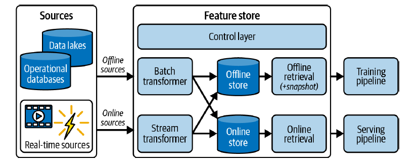

# O que é Feature Store?

As primeiras implementações de Feature Stores vieram de empresas como Uber, Twitter e Spotify, onde modelos de ML e IA são centrais para o negócio. 

Em uma postagem de 2017 no blog de engenharia da Uber ([https://www.uber.com/en-BR/blog/michelangelo-machine-learning-platform/](https://www.uber.com/en-BR/blog/michelangelo-machine-learning-platform/)), é possível checar alguns relatos sobre o uso de Feature Store na plataforma de ML deles, o Michelangelo.

>  *... adicionamos uma camada de gerenciamento de dados, um Feature Store que permite que as equipes compartilhem, descubram e usem um conjunto de features altamente selecionado para seus problemas de ML. Descobrimos que muitos problemas de modelagem na Uber usam features idênticas ou semelhantes, e há um valor substancial em permitir que as equipes compartilhem features em seus projetos, e que equipes de diferentes projetos compartilhem features entre si.*

E ainda...

> *Até o momento, temos aproximadamente 10.000 features no Feature Store que são usadas ​​para acelerar projetos de ML, e as equipes de toda a empresa estão adicionando novas features o tempo todo. As features do Feature Store são calculados automaticamente e atualizados diariamente.*

Feature Stores geralmente operaram como uma fábrica e/ou como um repositório central de features para ML, em que dependendo da solução utilizada de Feature Store, é possível realizar o gerenciamento da coleta de dados brutos de várias fontes, realizar transformações, armazenar, catalogar, versionar, garantir a segurança do dado, servir e monitorar features. 

O Feature Store é um recurso no sistema de ML que possibilita a automatização de processos reduzindo os esforços de engenharia através da criação de um catálogo compartilhado de features prontas para utilização, permitindo a colaboração e compartilhamento de features entre equipes, com objetivo de acelerar a entrega de sistemas de ML. 

## Provedores de Feature Store

Hoje, existem múltiplas implementações comerciais e open source de Feature Store. Idealmente soluções de Feature Store avançadas devem oferecer todas as funcionalidade citadas aqui anteriormente. Comparar cuidadosamente as capacidades de diferentes provedores de Feature Stores é essencial, pois algumas soluções podem ter limitações, não fornecendo algumas funcionalidades que podem ser indispensáveis para o contexto do sistema de ML que está sendo desenvolvido. A seguir segue um comparativo de soluções atualmente disponíveis de Feature Store (Adaptado de: [Yaron Haviv, Noah Gift. Implementing MLOps in the Enterprise - A Production-First Approach. O'Reilly Media, Inc. 2023](https://www.oreilly.com/library/view/implementing-mlops-in/9781098136574/)).

| Categoria                                         | Feast                                    | Tecton            | MLRun                              | SageMaker    | Vertex AI      | Databricks        | HopsWorks            |
|---------------------------------------------------|------------------------------------------|-------------------|------------------------------------|--------------|----------------|-------------------|----------------------|
| Código aberto                                     | Sim                                      | Não               | Sim                                | Não          | Não            | Não               | Sim                  |
| Opção gerenciada                                  | Não                                      | principais clouds | cloud + on-prem                   | na AWS       | na GCP         | principais clouds | cloud + on-prem      |
| Pipelines offline                                 | Não                                      | Sim               | Sim                                | Não          | Não            | Não               | Sim                  |
| Pipelines em tempo real                           | Não                                      | Sim               | Sim                                | Não          | Não            | Não               | Não                  |
| Recuperação de funcionalidades                    | Sim                                      | Sim               | Sim                                | Sim          | Sim            | Sim               | Sim                  |
| Motores de execução                               | Spark                                    | Spark             | Python, Dask, Spark, Nuclio        | Nenhum       | Spark          | Spark             | Spark, Flink         |
| Análise de funcionalidades                        | Sim                                      | Não               | Sim                                | Sim          | Não            | Não               | Sim                  |
| Versionamento e linhagem                          | Não                                      | Sim               | Sim                                | Não          | Não            | Não               | Sim                  |
| Segurança das funcionalidades                     | Não                                      | Sim               | Sim                                | Sim          | Não            | Não               | Não                  |
| Monitoramento                                     | Não                                      | Sim               | Sim                                | Não          | Não            | Não               | Sim                  |
| Treinamento e serviço, integrado e automatizado   | Não                                      | Não               | Sim                                | Não          | Não            | Não               | Sim                  |

## Feature Store na Arquitetura do Sistema de ML

A figura a seguir ilustra uma arquitetura teórica de um Feature Store, ele ilustra como os dados são ingeridos, transformados e disponibilizados para diferentes pipelines de ML.

  <figure>
    
    <figcaption style="font-size: 12px; font-weight: bold;">
      Fonte: <a href="https://www.oreilly.com/library/view/implementing-mlops-in/9781098136574/" style="font-size: 14px; font-weight: bold;">Yaron Haviv, Noah Gift. Implementing MLOps in the Enterprise - A Production-First Approach. O'Reilly Media, Inc. 2023</a>
    </figcaption>
  </figure>

Fluxo:

- **Ingestão de Dados**: Os dados são ingeridos de várias fontes, incluindo data lakes, bancos de dados operacionais e fontes em tempo real.

- **Transformação de Dados**: Os dados offline são transformados pelo `Batch Transformer`, enquanto os dados em tempo real são transformados pelo `Stream Transformer`.

- **Armazenamento de Features**: Features transformadas são armazenadas em dois tipos de storages:
  - `Offline Store` para treinamento e análise.
  - `Online Store` para inferência em tempo real.

- **Recuperação de Features**:
  - `Offline Retrieval` recupera features para o `Training Pipeline`.
  - `Online Retrieval` recupera features para o `Serving Pipeline`.

O diagrama mostra como o Feature Store centraliza e gerencia as features de ML, permitindo uma integração eficiente entre as etapas de transformação de dados, armazenamento e recuperação, tanto para treinamento quanto para inferência em tempo real. Isso facilita a construção de pipelines de ML mais robustos e eficientes, garantindo que os modelos sejam alimentados com dados de alta qualidade e atualizados.

> **IMPORTANTE!** Como já foi citado, nem todas as provedoras de Feature Store possuem as funcionalidades do desenho acima, o desenho ilustra uma arquitetura teórica de um serviço de Feature Store. Alguns provedores tem foco somente na catalogação e não possuem funcionalidade de automatização do processo de ingestão ou transformação, que são as tarefas mais trabalhosas.
